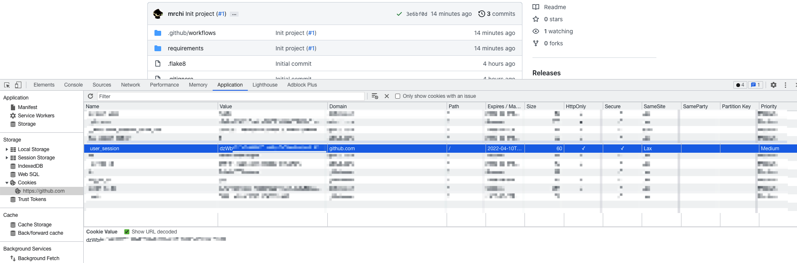
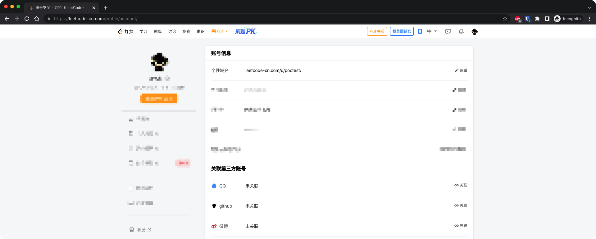
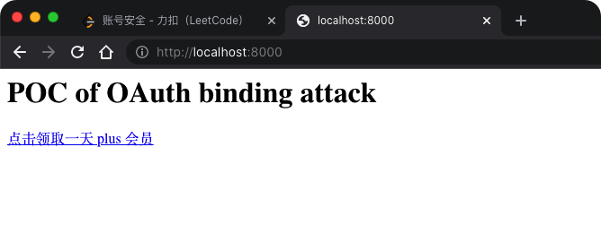
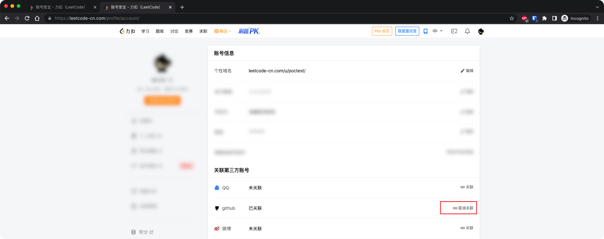

# poc-of-oauth-binding-attack

[](https://github.com/mrchi/poc-of-oauth-binding-attack/actions/workflows/linting.yaml)


一个用于演示 OAuth 2.0 账号绑定攻击的 POC，以 leetcode-cn.com 为例。

**leetcode-cn.com 目前已修复该漏洞，本 repo 公开已获得 leetcode-cn.com 同意。**

## POC 说明

在 leetcode-cn.com 上的漏洞利用条件：
- 受害者已经登录 leetcode-cn；
- 受害者没有仔细观察跳转后个人中心页面的 GitHub 账号绑定提示。

### 准备

**以下模拟攻击者操作。**

使用 Python 3.10 开发。

首先 clone 代码，新建 Python 虚拟环境，安装依赖：

```
git clone https://github.com/mrchi/poc-of-oauth-binding-attack.git
cd poc-of-oauth-binding-attack
python -m venv .venv
source .venv/bin/activate
pip install -r requirements/common.txt
```

**由于代码写的比较简单，为了 POC 中调起 OAuth 流程时不需要点击授权确认按钮，请先用自己的 leetcode-cn.com 账号绑定一次 GitHub 账号再解绑。**

在浏览器中打开控制台，找到 GitHub 的 cookie `user_session`



将 cookie 的值设置为环境变量 `GITHUB_USER_SESSION`

```
export GITHUB_USER_SESSION=****
```

启动 web 服务

```
uvicorn poc.fishing:app --host 0.0.0.0 --port 8000
```

### 验证

**以下模拟受害者操作。**

在另一主机上登录其他 leetcode-cn.com 的账号



诱骗其访问钓鱼页面



点击链接后，跳转到了个人中心，同时 GitHub 账号已经绑定成功。



---

至此我们成功地在不物理接触受害者终端的情况下，将自己的 GitHub 账号绑定到了受害者的 leetcode-cn.com 的账号上。可以用自己的 GitHub 来登录受害者的 leetcode-cn.com 的账号进行未授权访问。

## 原因与修复

### 原因

leetcode-cn.com 把第三方发起的 OAuth 授权回调，误认为了是受害者自己发起的，导致了错误的绑定。

### 防御

根据 OAuth 协议，服务在向认证服务器发起 OAuth 重定向时，可以携带一个 state 参数，认证服务器在用户授权后回调重定向到服务时，会把这个 state 参数带回。可以通过校验 state 参数来确认 OAuth 请求来源不是第三方。

具体流程：
1. 发起 OAuth 重定向时，带上随机的 state 参数，同时把 state 参数保存到用户浏览器本地（例如 cookie 中）；
2. 收到 OAuth 回调时，检查：
    - 认证服务器返回的 state 参数存在；
    - 用户浏览器本地带上的 state 参数存在；
    - 上述 state 参数一致；

第三方攻击者可以诱骗受害者点击链接，但无法修改受害者浏览器中本地的 state 参数，达到防御目的。
